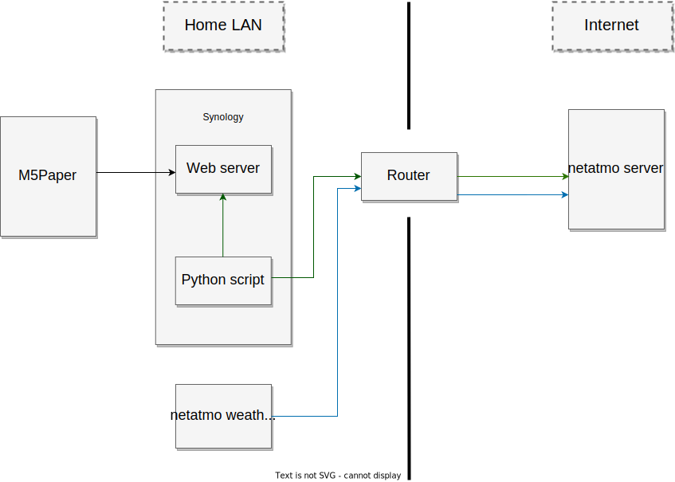

# Display-netatmo-weather-station-on-M5Paper
Display netatmo weather station on M5Paper

## The beginning...
A couple of months ago I decided to replace my old fashined weather station at home with something more up to date.

I decided to go for a netatmo weather station with an outdoor sensor. 
I didn't care about the missing display because it has a nice app.

I got the weather station and installed it. 
From now on everytime I wanted to check the temperature outside I had to take my mobile and open the netatmo app.

Well... after a couple of weeks I found it quite annoying to take the mobile just to check the temperature outside.

So I started to investigatre if there is a way to display the netatmo weather station data on a third party display.

After some hours of searching, reading and evaluation I found this:

https://shop.m5stack.com/products/m5paper-esp32-development-kit-v1-1-960x540-4-7-eink-display-235-ppi

I managed to buy an used one but in good shape.

I'm not a professional software developer so my next steps were to check how to get the data displayed on the M5Paper and to look for examples.

## Approach
netatmo provides an API to get the the data from the weather station.

I found also I python library with all the stuff about authentication already implemented.

https://github.com/philippelt/netatmo-api-python

I didn't find such a library for the ESP32/Arduino, which is the board used in the M5Paper.

My approach was to create a python script to fetch data from the netatmo server.

Then parse the data for the last measurement and place the values I need as a json file on the webserver running on my synology.

After that the M5Paper will fetch the values to be displayed from the web server running on my synology.

## Python script
My python script is basically a copy of the example from https://github.com/philippelt/netatmo-api-python/blob/master/usage.md

I just added some additional lines of code to get only the data I wanted to display on the M5Paper.

Then created a json object a wrote it to a file on my web server on the Synology.
The script is running on my Synology every 5 minutes, 
it means every 5 minutes the data from the netatmo server gets fetched and a json file is saved on the web server on the Synology.

## M5Paper Sketch
Basically I created three different canvas.
- The canvas on the top is displaying time and date.
- The canvas on the left is displaying indoor temperature and humidity.
- The canvas on the right is displaying outdoor temperature and humidity. 

